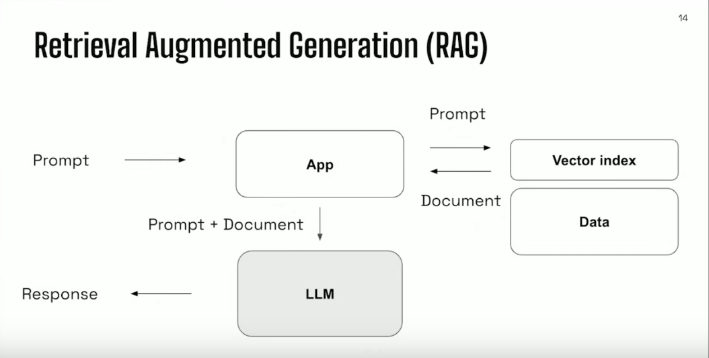
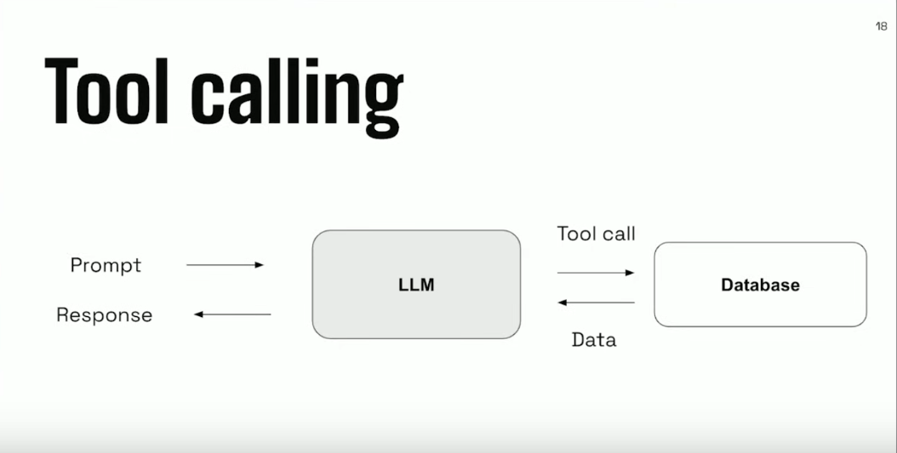

# Build-Bigger-With-Small-Data-And-AI

Conference : https://www.youtube.com/watch?v=P-55pV6ss3k&t=876s     
Ollama : https://github.com/ollama/ollama       
Python : https://github.com/ollama/ollama-python        
Docker : https://hub.docker.com/r/ollama/ollama     
Figures : https://www.youtube.com/watch?v=tcqEUSNCn8I

```bash
# Start the Docker container
docker run -d -v ollama:/root/.ollama -p 11434:11434 --name ollama ollama/ollama

# Pull the LLaMA model
docker exec -it ollama ollama pull llama3.2

# List available models
docker exec -it ollama ollama list

# Delete LLaMA model
docker exec -it ollama ollama rm gemma2:2b 
```

## 1. RAG
<p align="center">
    
</p>

> Do ducks dive ?  
Yes, ducks can dive. 

> How fast do ducks fly ?  
Ducks can reach speeds of up to 100 mph in flight.

> How high can ducks fly ?  
Ducks can fly at altitudes ranging from 200 to 4,000 feet, with some species capable of reaching heights of up to 21,000 feet.

## 2. Tool calling
<p align="center">
    
</p>

> What color is Marty McFly ?    
The color of Marty McFly is red.  

> How many ducks are yellow ?  
There are 3 ducks that are yellow.

## 3. References
<p align="center">
    
</p>
